# Полное руководство по 1C-Consultant 4.2.3

Документ описывает текущую архитектуру, установку и работу 1C-Consultant. Здесь
`installer` — программа установки и обновления, а `сервис` — само приложение для
ведения консультационных проектов 1С.

Pi в версии 4.2.3 отсутствует: его нет в installer, manifest, launcher, составе
Release и списке внешних интерфейсов.

## Содержание

1. [Что входит в систему](#что-входит-в-систему)
2. [Общая схема](#общая-схема)
3. [Установка](#установка)
4. [Как работает installer](#как-работает-installer)
5. [Каталоги и файлы установки](#каталоги-и-файлы-установки)
6. [Запуск сервиса](#запуск-сервиса)
7. [Как работает сам сервис](#как-работает-сам-сервис)
8. [Жизненный цикл проекта](#жизненный-цикл-проекта)
9. [AI-роли и модели](#ai-роли-и-модели)
10. [Граф знаний и поиск](#граф-знаний-и-поиск)
11. [Проверки результата](#проверки-результата)
12. [Артефакты проекта](#артефакты-проекта)
13. [Codex, OpenCode и Claude Code](#codex-opencode-и-claude-code)
14. [Обновление, откат и удаление](#обновление-откат-и-удаление)
15. [Безопасность](#безопасность)
16. [Диагностика и команды](#диагностика-и-команды)
17. [Типовые сценарии](#типовые-сценарии)

## Что входит в систему

Система состоит из четырёх основных частей.

| Часть | Назначение |
|---|---|
| Go installer | Установка, обновление, откат приложения, управление графами и удаление |
| 1C-Consultant | Создание проектов, вопросы, моделирование решения, инструкция и экспорт |
| SQLite-граф 1С | Поиск объектов, документов, маршрутов и доказательств по 1С:ERP |
| AI-роли | Нормализация требований, проектирование решения и подготовка инструкции |

Installer не является фоновым Windows Service. 1C-Consultant тоже не работает
постоянно в фоне. Обе программы запускаются только по действию пользователя.

## Общая схема

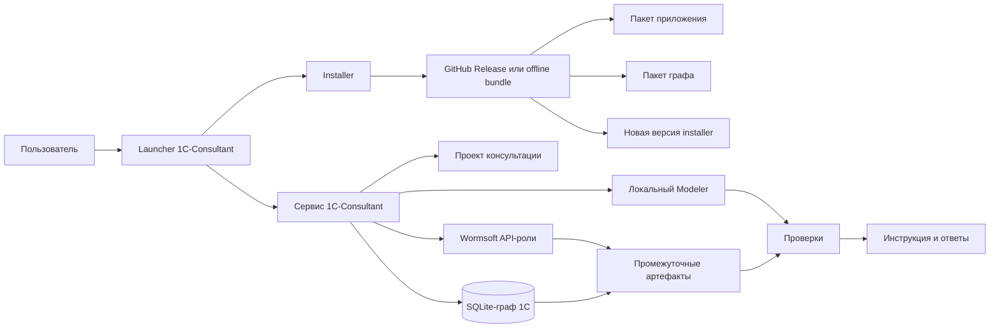

Главный принцип: интерфейс управляет процессом, Python workflow хранит состояние и
контролирует переходы, граф даёт доказательный контекст, AI-роли создают смысловой
материал, проверки не дают принять неподтверждённый результат.

## Установка

### Поддерживаемые платформы

| Система | Архитектура | Установочный файл |
|---|---|---|
| Windows | x64 | `1c-consultant-setup-windows-x64.zip` |
| Linux | x64 | `1c-consultant-setup-linux-x64.zip` |
| Linux | ARM64 | `1c-consultant-setup-linux-arm64.zip` |
| macOS | Intel x64 | `1c-consultant-installer-macos-x64.pkg` |
| macOS | Apple Silicon ARM64 | `1c-consultant-installer-macos-arm64.pkg` |

Готовые файлы находятся в
[последнем GitHub Release](https://github.com/ilnurcode/Modelirovanie/releases/latest).

### Windows

1. Скачайте `1c-consultant-setup-windows-x64.zip`.
2. Распакуйте архив в обычную папку.
3. Запустите `Install 1C-Consultant.cmd`.
4. Если SmartScreen показывает предупреждение, проверьте источник файла и разрешите
   запуск вручную.
5. Выберите `1. Установить или обновить`.
6. Выберите интернет или распакованный offline bundle.
7. Подтвердите установку приложения и нужных графов.

После установки создаются ярлыки `1C-Consultant` на рабочем столе и в меню «Пуск».

### Linux

1. Скачайте архив своей архитектуры.
2. Распакуйте его.
3. Разрешите запуск `Install 1C-Consultant.sh`, если файловый менеджер запросит это.
4. Запустите файл и выполните те же пункты installer.

### macOS

1. Скачайте `.pkg` своей архитектуры.
2. Откройте пакет и завершите установку.
3. Запустите `1C-Consultant` из `/Applications`.
4. Если macOS блокирует неподписанный пакет, используйте `Открыть` в контекстном
   меню после проверки источника.

### Интернет и offline bundle

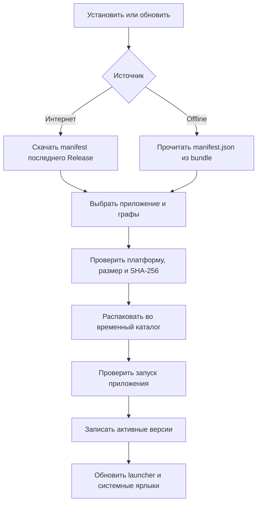

При установке через интернет manifest и артефакты загружаются только по HTTPS.
Offline bundle содержит manifest, приложение, installer и граф, необходимые для
установки без сети.

## Как работает installer

### Главное меню

| Пункт | Что делает |
|---|---|
| Установить или обновить | Устанавливает выбранное приложение и графы, обновляет installer |
| Показать установленные версии | Читает локальный `installed.json`, интернет не нужен |
| Проверить обновления | Сравнивает локальные версии с текущим manifest |
| Откатить приложение | Меняет активную версию на предыдущую |
| Управление графами | Показывает, скачивает, обновляет, откатывает и удаляет графы |
| Удалить 1C-Consultant | Удаляет управляемую установку после подтверждения |

### Manifest

`manifest.json` описывает:

- версию приложения;
- артефакт приложения для каждой ОС и архитектуры;
- версию installer;
- installer-бинарник для каждой платформы;
- доступные графы, их версии и минимальную версию приложения;
- URL, размер и SHA-256 каждого артефакта.

В manifest 4.2.3 верхний уровень содержит только:

```text
schema_version
application
installer
graphs
```

### Установка приложения

Installer выбирает артефакт по текущим ОС и архитектуре. Архив сначала попадает во
временный каталог, проверяется, безопасно распаковывается в
`app/<version>/`, затем выполняется health check `consultant --version`.

Только после успешной проверки версия становится активной. При переходе на новую
версию прежняя активная версия записывается как предыдущая и остаётся доступной для
отката.

### Установка графа

Граф хранится отдельно от приложения:

```text
graphs/<graph-id>/<configuration-version>/<graph-version>/
```

Installer проверяет:

- безопасный ID и номер версии;
- совместимость с активной версией приложения;
- размер и SHA-256 архива;
- отсутствие выхода распакованных путей за каталог установки.

При обновлении графа старая версия остаётся на диске. Откат меняет активный путь в
состоянии, не скачивая архив повторно.

### Обновление самого installer

Installer тоже хранится версионно:

```text
installer/<version>/<installer-binary>
```

Поэтому после первой установки не нужно каждый раз скачивать setup-архив. Launcher
запускает активный installer из локального каталога.

### Миграция с версии, где был Pi

Во время обновления до 4.2.3 installer удаляет только старые управляемые пути внутри
корня 1C-Consultant:

```text
tools/pi/
tools/node/
1C-Consultant-Pi.cmd
1c-consultant-pi
```

Другие программы Node.js в системе не затрагиваются. Пользовательские проекты,
графы и версии приложения сохраняются.

## Каталоги и файлы установки

### Корневой каталог

| ОС | Каталог данных |
|---|---|
| Windows | `%LOCALAPPDATA%\1C-Consultant` |
| Linux | `$XDG_DATA_HOME/1c-consultant` или `~/.local/share/1c-consultant` |
| macOS | `~/Library/Application Support/1C-Consultant` |

### Структура

```text
1C-Consultant/
├── app/
│   ├── <active-version>/
│   └── <previous-version>/
├── installer/
│   └── <version>/
├── graphs/
│   └── <graph-id>/<configuration>/<version>/
├── config/
│   ├── installed.json
│   ├── consultant.local.toml
│   └── selected-project.txt
├── results/
├── examples/approved/
├── logs/installer.log
├── temp/
├── AGENTS.md
├── consultant.cmd или consultant
└── 1C-Consultant.cmd или 1c-consultant
```

`app/`, `installer/` и `graphs/` — управляемые версионные данные. `results/` и
`config/consultant.local.toml` — постоянные пользовательские данные. Обновление
приложения их не удаляет.

`config/installed.json` содержит активную и предыдущую версии, пути и установленные
графы. Installer записывает этот файл атомарно: сначала создаёт временный файл,
затем заменяет рабочий.

## Запуск сервиса

Launcher показывает короткое меню:

1. Запустить 1C-Consultant.
2. Открыть управление установкой и графами.
0. Выйти.

Если launcher получает аргументы командной строки, он сразу передаёт их сервису.
Перед запуском задаются:

```text
CONSULTANT_DATA_DIR=<корень установки>
CONSULTANT_INSTALL_ROOT=<корень установки>
```

Затем launcher переходит в каталог активной версии приложения и запускает её
исполняемый файл. На Windows используется `1C-Consultant.cmd`, на Linux —
`1c-consultant`, на macOS приложение открывает командный launcher в Terminal.

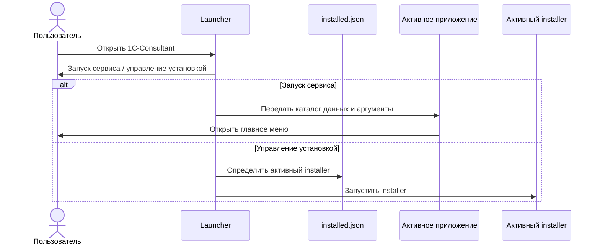

## Как работает сам сервис

Сервис собран в отдельный исполняемый файл, но основной workflow написан на Python.
Устанавливать Python обычному пользователю не нужно. Python 3.11+ требуется только
для запуска исходного кода и разработки.

При старте создаётся объект приложения и подключаются службы:

- хранилище проектов;
- настройки;
- workflow;
- AI-профили и API-роли;
- графовый поиск;
- локальная аналитика;
- Modeler и валидация;
- телеметрия;
- экспорт;
- реестр подтверждённых примеров.

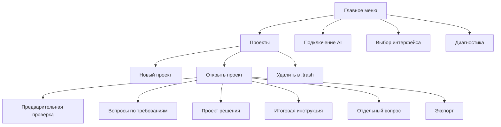

### Создание проекта

Пользователь задаёт:

- название;
- исходное ТЗ текстом или UTF-8 Markdown-файлом;
- продукт и редакцию 1С;
- точный релиз;
- уровень детализации;
- при необходимости AI-профиль.

Исходный текст сохраняется в проекте. Новый проект всегда использует единый hybrid
процесс: отдельного старого или упрощённого режима нет.

### Предварительная проверка без LLM

`preflight` не выполняет платный AI-вызов. Он:

1. читает проект и его текущую ревизию;
2. определяет разрешённые источники для продукта и релиза;
3. выполняет локальный hybrid search;
4. расширяет найденные узлы по типизированным связям;
5. строит или обновляет аналитическую модель;
6. запускает Modeler-кандидаты;
7. сохраняет компактный графовый контекст.

Если релиз конфигурации не подтверждён, локальные XML-данные не повышаются до
доказательства. Такие сведения остаются candidate или unresolved.

## Жизненный цикл проекта

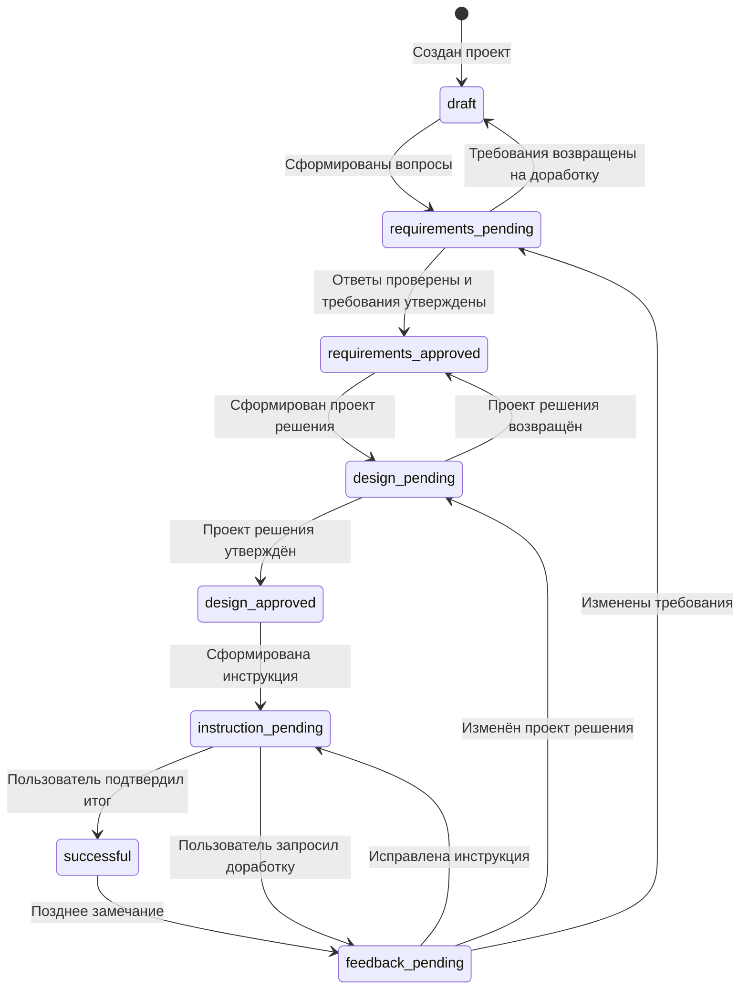

Названия внутренних состояний могут отображаться пользователю более простыми
словами: `В разработке`, `Не подтверждён`, `Подтверждён`.

### Этап 1. Требования

Роль `erp-translator` получает исходное ТЗ и локальный доказательный контекст. Она:

- разбивает пожелания на атомарные требования;
- группирует требования;
- выделяет неоднозначности;
- формирует вопросы;
- не придумывает отсутствующие решения.

Пользователь отвечает на вопросы и отдельно утверждает требования. Без этого проект
решения не создаётся.

### Этап 2. Проект решения

Роль `erp-process-planner` строит:

- верхнюю цепочку документов;
- основной процесс;
- альтернативные и параллельные ветви;
- связь требований с решением;
- GAP для неподтверждённых возможностей;
- ожидаемые проверки и тесты.

Пользователь утверждает проект решения или возвращает его на доработку.

### Этап 3. Итоговая инструкция

Роль `instruction-writer` создаёт итоговые материалы:

- описание процесса;
- инструкцию консультанта;
- при необходимости сценарий Vanessa Automation;
- трассировку требований, решений и доказательств.

Инструкция не получает статус `successful` автоматически. Требуется отдельное
финальное подтверждение пользователя.

### Доработки и ревизии

Изменение ответа или замечание:

- создаёт новую ревизию;
- отзывает зависимые approvals;
- сохраняет предыдущую версию в `revisions/`;
- перестраивает только затронутые части аналитики;
- исключает отозванный результат из подтверждённых примеров.

Файлы проекта записываются атомарно. Для защиты от одновременного изменения
используется блокировка проекта.

## AI-роли и модели

Основной API-маршрут закреплён в `agent-runtime-policy.json`.

| Этап | Роль | Модель |
|---|---|---|
| Требования и вопросы | `erp-translator` | `wormsoft/agent/low` |
| Проект решения | `erp-process-planner` | `wormsoft/agent/medium` |
| Итоговая инструкция | `instruction-writer` | `wormsoft/agent/high` |

Вызовы выполняются последовательно. Автоматические повторы отключены. Одинаковый
успешный вызов может быть повторно использован из сохранённого результата.

### API-ключ

Приоритет ключей:

1. `NEWAGENT_API_KEY`;
2. `WORMSOFT_API_KEY`;
3. разрешённые локальные `.env`.

Пример:

```dotenv
WORMSOFT_API_KEY=ваш_ключ
```

Ключ не записывается в проект, Markdown, телеметрию, manifest или Git. В журналах
сохраняется техническая информация о вызове, но не секрет.

### Локальные и внешние AI-профили

Через меню подключения AI можно сохранить профиль установленного Codex, OpenCode,
Claude Code или OpenAI-compatible API. Секрет API-профиля задаётся через имя
переменной окружения, а не хранится в `consultant.local.toml`.

Основной предметный workflow использует фиксированные Wormsoft-роли. Внешний CLI
остаётся интерфейсом работы с тем же сервисом, а не вторым независимым workflow.

## Граф знаний и поиск

Граф хранится в SQLite и открывается сервисом в режиме read-only.

### Четыре слоя

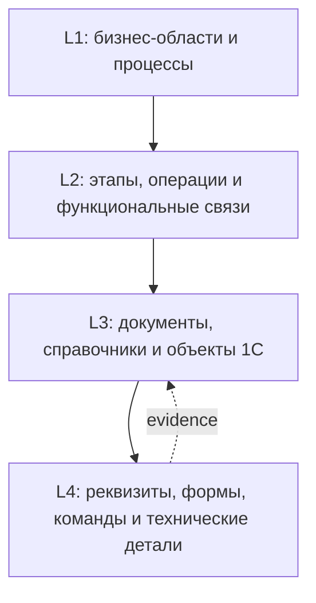

### Hybrid search

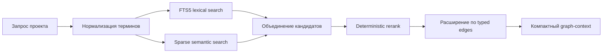

Результат содержит:

- `id` и `canonical_id`;
- название и путь;
- слой и тип узла;
- короткий preview;
- тип связи и вес;
- `source_ref` и evidence.

Поиск не копирует весь граф в prompt. В AI-контекст передаётся ограниченный,
проверяемый набор узлов и связей.

### Статусы достоверности

| Статус | Можно использовать как шаг инструкции |
|---|---|
| `verified` | Да |
| `verified_metadata` | Да |
| `candidate` | Нет, только кандидат или GAP |
| `inferred` | Нет |
| `unresolved` | Нет |

Неподтверждённый объект нельзя автоматически превратить в реальную команду
пользователю. Он должен быть вынесен в GAP или запрос на уточнение.

## Проверки результата

После генерации выполняются независимые проверки.

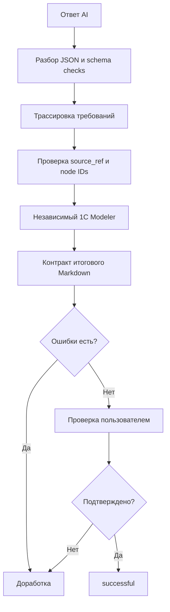

Проверяется, что:

- каждое требование покрыто решением или GAP;
- покрытые требования имеют acceptance tests;
- верхняя цепочка документов стоит в начале ответа;
- node IDs реально существуют в графе;
- candidate/inferred/unresolved не стали подтверждёнными действиями;
- маршрут пользователя не выдуман;
- версия конфигурации соответствует разрешённым источникам;
- итог связан с точным prompt, моделью и параметрами вызова;
- финальное подтверждение пользователя действительно существует.

## Артефакты проекта

```text
results/<project-id>/
├── project.yaml
├── 00-source.md или 00-request.md
├── 01-requirements.md
├── 02-design.md
├── 03-instruction.md
├── analysis/
├── agent_artifacts/
│   ├── graph-context-rNNN.json
│   ├── *-prompt.txt
│   ├── *-execution.json
│   └── результаты ролей
├── answers_md/
├── revisions/
└── events.ndjson
```

| Файл или каталог | Содержимое |
|---|---|
| `project.yaml` | Состояние проекта, версии этапов и approvals |
| `01-requirements.md` | Требования, вопросы, ответы и неопределённости |
| `02-design.md` | Проект решения, ветви, GAP и тесты |
| `03-instruction.md` | Текущая итоговая инструкция |
| `analysis/` | Локальная аналитическая модель |
| `agent_artifacts/` | Prompt, ответ, модель, токены, время и graph-context |
| `answers_md/` | Версии итоговых ответов и ответы на отдельные вопросы |
| `revisions/` | Предыдущие версии после доработок |
| `events.ndjson` | Хронология событий проекта |

Удаление проекта переносит его в `results/.trash/`. Это защищает от случайной
безвозвратной потери.

Подтверждённый результат может быть добавлен в `examples/approved/`. Отозванный или
не прошедший проверки результат примером не становится.

## Codex, OpenCode и Claude Code

Доступные внешние интерфейсы:

- Codex Desktop;
- OpenCode;
- Claude Code.

Сервис создаёт общий workspace в корне установки:

- `AGENTS.md` — правила обращения к сервису;
- `consultant.cmd` или `./consultant` — безопасная команда запуска;
- `config/selected-project.txt` — ID выбранного проекта.

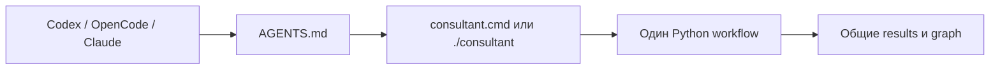

Codex запускается командой `codex app <workspace>`. OpenCode открывает каталог
workspace. Claude Code запускается установленной CLI-командой. Эти программы должны
быть установлены и авторизованы отдельно.

Интерфейс не должен вручную менять `project.yaml`, `installed.json` или файлы
графа. Все действия выполняются командами сервиса, чтобы сохранились approvals,
ревизии и журнал событий.

## Обновление, откат и удаление

### Обновление приложения

1. Откройте launcher.
2. Выберите управление установкой.
3. При необходимости выполните `Проверить обновления`.
4. Выберите `Установить или обновить`.
5. Подтвердите приложение и графы.

Новая версия помещается рядом со старой. После health check launcher переключается
на новую версию. Проекты и настройки остаются в постоянном каталоге данных.

### Откат приложения

Откат меняет местами активную и предыдущую версии. Архив повторно не скачивается.
После переключения launcher и системные ярлыки обновляются.

Откат возможен, только если предыдущая версия присутствует в состоянии и её каталог
не удалён.

### Откат графа

В `Управлении графами` выберите установленный граф и `Откатить версию`. Installer
переключит активный путь на предыдущую сохранённую версию.

### Удаление графа

Удаление графа удаляет все его версии внутри выбранного `graph-id`. Приложение,
проекты и другие графы остаются.

### Полное удаление

Команда удаления:

1. проверяет, что в каталоге есть управляемый `config/installed.json`;
2. требует подтверждение;
3. удаляет созданные installer системные ярлыки;
4. удаляет корень управляемой установки.

На macOS приложение, установленное через `.pkg` в `/Applications`, может потребовать
отдельного удаления.

## Безопасность

### Проверка загрузок

- manifest принимается только по HTTPS;
- редирект с HTTPS на другой протокол запрещён;
- размер manifest ограничен;
- каждый артефакт проверяется по SHA-256;
- при наличии ожидаемого размера проверяется и размер;
- версия активируется только после успешного health check.

### Безопасная распаковка

Installer проверяет каждый путь из ZIP или TAR.GZ. Абсолютные пути и выход через
`..` за каталог назначения запрещены. Символические ссылки из ZIP запрещены; ссылки
из TAR не устанавливаются.

### Защита от опасного удаления

Installer не удаляет корень диска или произвольный каталог. Для полного удаления
обязателен `installed.json`. Удаление отдельного графа ограничено каталогом
`graphs/<id>`.

### Секреты и приватность

Release не содержит:

- API-ключи;
- пользовательские проекты;
- локальные AI-профили;
- исходные XML конфигурации;
- сырые материалы ИТС.

Опубликованный граф содержит производные индексированные данные и ссылки на
источники, но не заменяет проверку лицензионных прав на исходные материалы.

## Диагностика и команды

Обычному пользователю достаточно меню. Команды полезны администратору и разработчику.

### Installer

```text
install         установить или обновить приложение и графы
status          показать локальные версии
check           сравнить версии с manifest
rollback        откатить приложение
remove-graph    удалить граф
rollback-graph  откатить граф
uninstall       удалить установку
version         показать версию installer
help            показать справку
```

Общие параметры:

```text
--data-dir <dir>
--manifest <https-url>
--offline-path <bundle-dir>
```

Пример автоматической установки:

```powershell
1c-consultant-installer.exe install --application --graphs erp-2.5.27.49 --non-interactive
```

### Сервис

Проверка без AI-вызова:

```powershell
consultant.cmd --repo . --json runtime-status
consultant.cmd --repo . --json graph-status
consultant.cmd --repo . --json graph-search "заказ клиента производство отгрузка"
```

Базовые команды проекта:

```powershell
consultant.cmd --repo . new demo --file "C:\path\tz.md" --product "1С:ERP Управление предприятием 2" --release "2.5.27.49"
consultant.cmd --repo . preflight demo
consultant.cmd --repo . run demo
consultant.cmd --repo . status demo
consultant.cmd --repo . validate demo
consultant.cmd --repo . export demo --format html
```

Дополнительные функции CLI включают ответы на вопросы, approvals, запрос
доработки, отдельные вопросы проекту, телеметрию, восстановление незавершённого
вызова и управление AI-профилями. Актуальный список выводит:

```powershell
consultant.cmd --help
```

### Журналы

- `logs/installer.log` — действия installer;
- `results/<project-id>/events.ndjson` — события проекта;
- `results/<project-id>/agent_artifacts/*-execution.json` — сведения об AI-вызове;
- `results/_agent_runs/<run-id>.jsonl` — журнал provenance внешних ролей.

## Типовые сценарии

### Первый запуск нового проекта

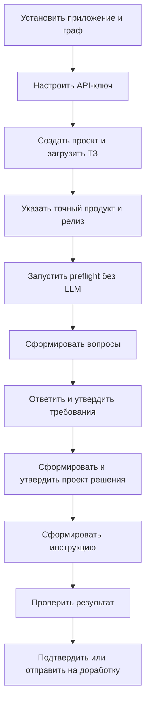

### Обновление без потери проектов

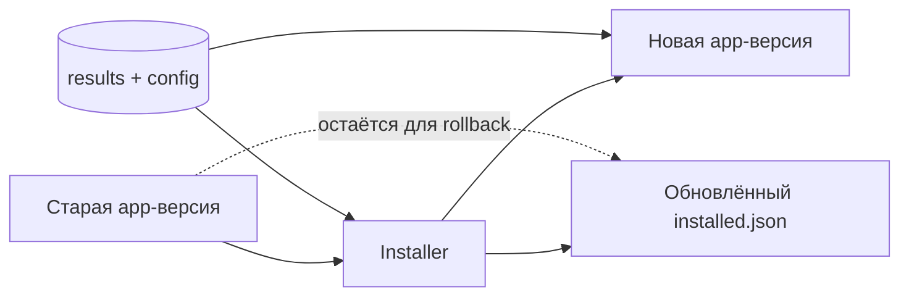

### Если AI-вызов прервался

Не удаляйте проект и не запускайте этап много раз вручную. Сервис сохраняет сырой
ответ и состояние вызова. Команда восстановления повторно использует доступный
артефакт и пытается завершить разбор без нового платного запроса.

### Если граф недоступен

1. Выполните `graph-status`.
2. Проверьте активный граф в installer.
3. При необходимости скачайте граф через `Управление графами`.
4. Повторите `preflight`.

Без графа сервис может выполнить только ограниченную работу. Неподтверждённые
сведения не должны становиться точными шагами инструкции.

### Если внешний интерфейс не запускается

1. Проверьте, что Codex, OpenCode или Claude Code установлены отдельно.
2. Проверьте авторизацию в выбранной программе.
3. Снова выберите интерфейс в главном меню.
4. Для проверки используйте встроенный интерфейс 1C-Consultant.

## Краткий итог

Installer отвечает за доверенную доставку и версии. Сервис отвечает за состояние
проекта и последовательность approvals. Граф отвечает за проверяемый контекст 1С.
AI-роли отвечают за смысловые материалы. Modeler, schema checks и пользовательское
подтверждение отвечают за качество итогового результата.

Ни один интерфейс не обходит общий workflow: встроенное меню, Codex, OpenCode и
Claude Code работают с одними проектами, графами, ревизиями и проверками.
