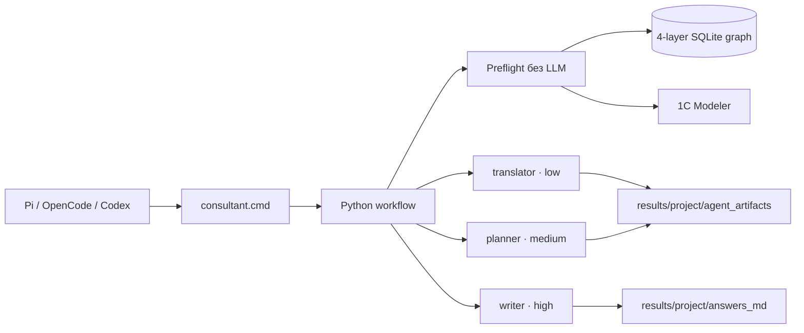

# NewAgent 4.1 — единая Python-first архитектура

## Цель

NewAgent объединяет сильные стороны двух исходных проектов без двух конкурирующих
хранилищ: четырёхслойный граф, hybrid search и source_ref Яны; lifecycle, approvals,
revisions и независимый Modeler Кирилла.

Интерфейс не выбирает модель и не создаёт предметные артефакты. Политика
`agent-runtime-policy.json` фиксирует Wormsoft endpoint, allowlist ролей, модели,
лимиты, ноль автоматических повторов и безопасные источники API-ключа.

## Графовый слой

`GraphSearchService` открывает опубликованный `erp_graph_mcp.sqlite` Яны в
read-only режиме. Запрос объединяет FTS5 и sparse semantic, нормализует semantic
score, применяет тот же deterministic rerank и расширяет выбранные семена по
типизированным рёбрам. В контекст сохраняются node/canonical IDs, слой, тип,
preview, edge relation/evidence и source_ref.

L1 ищет бизнес-сценарий, L2 — ось уточнения, L3 подтверждает объект/UI/поле,
L4 — смысл, пользовательский порядок и ограничения. Поисковый score остаётся
candidate; подтверждение строится только по L3/L4 и точному релизу.

## Жизненный цикл

`configured → requirements_pending → requirements_approved → design_pending →
design_approved → feedback_pending → successful`.

Изменение ответа/контекста переводит проект в новую ревизию, отзывает затронутые
approvals и исключает старый ответ из успешных примеров. Файлы перезаписываются
атомарно, предыдущая версия архивируется в `revisions/`.

Перед каждым платным этапом доступен `preflight`: source routing, incremental
analytics, hybrid graph context и Modeler candidates без LLM. Затем workflow
последовательно вызывает не более одной роли этапа:

- requirements/questions: `erp-translator → wormsoft/agent/low`;
- design/solution model: `erp-process-planner → wormsoft/agent/medium`;
- instruction: `instruction-writer → wormsoft/agent/high`.

## Контракт результата

Design и instruction содержат структурированный `document_flow`. Renderer выводит
его первым блоком: основной маршрут, затем параллельные, альтернативные и возвратные
ветви. Доступны deliverables:

- `hybrid` (по умолчанию) — полный сквозной процесс и подробная инструкция
  консультанта в одном проекте;
- `process` — сквозной процесс, документы, роли, условия и контроль;
- `consultant` — предварительные настройки и verified UI-действия;
- `vanessa` — тот же verified маршрут плюс Gherkin.

Instruction проходит JSON/schema checks и независимый Modeler. Candidate, inferred
и unresolved запрещены в подтверждённых шагах. Draft сохраняется в `answers_md`;
successful возможен только после отдельного финального approval пользователя.

## Интерфейсы

`.codex/config.toml` не запускает MCP. Codex и OpenCode читают `AGENTS.md` и
вызывают Python CLI. Pi использует `.pi/extensions/newagent-workspace.ts` и команду
`/erp`; кнопки вызывают тот же CLI. Секрет остаётся только в окружении процесса.
