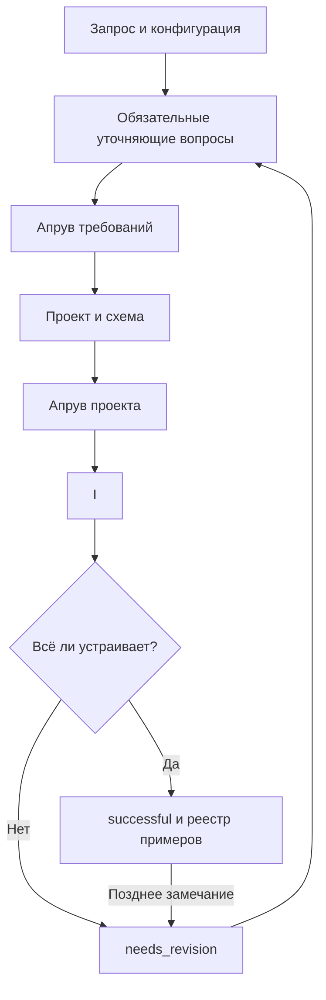

# Архитектура

## Слои

1. **Source** — локальная исходная документация в `source/`, не публикуемая по умолчанию.
2. **Knowledge** — нормализованные статьи, процессы и лёгкий граф.
3. **Metadata** — локальный индекс XML и компактные проверенные срезы.
4. **Delivery** — общие шаблоны и переносимые `SKILL.md`.
5. **Application** — модель проектов, маршрутизация источников, шлюзы, AI-адаптеры, экспорт и проверки.
6. **Adapters** — короткие указатели для конкретных агентов без копирования общей логики.

## Поток проекта

Состояние хранится атомарно в `results/<project-id>/project.yaml`, события — в `events.ndjson`, прежние версии — в `revisions/`. AI возвращает структурированный результат, а переходы состояния выполняет приложение.

## Трассировка и форматы

- статьи и процессы: Markdown с YAML frontmatter;
- граф и журналы: NDJSON;
- проект: YAML;
- контракт генерации и экспорта: JSON Schema;
- диаграммы: Mermaid внутри Markdown.

Процесс ссылается на статьи через `knowledge_refs`, граф — через `source_refs`, инструкция приводит источник рядом с проверяемым шагом. Форматы не зависят от конкретной модели, MCP или API.
