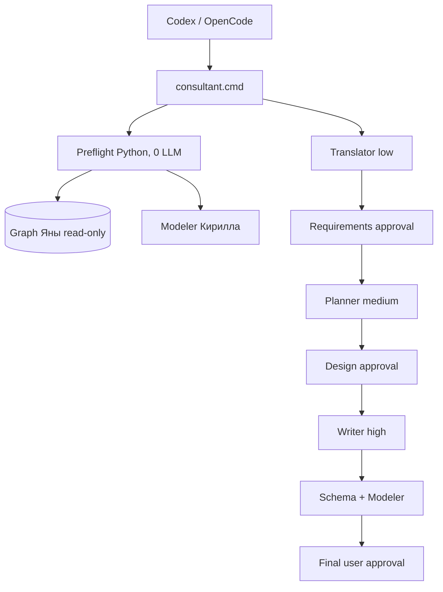

# Карта гибридной интеграции

| Область | Взято у Кирилла | Взято у Яны | NewAgent 4.1 |
|---|---|---|---|
| Хранилище | results, atomic writes, revisions | task artifacts/answers | единый results, agent_artifacts, answers_md |
| Lifecycle | статусы и три approval gate | корректировки контекста/решений | адресный отзыв approval и сохранённая история |
| Поиск | локальные статьи/Modeler index | L1-L4, FTS5, semantic, rerank, typed edges | прямой Python read-only SQLite reader |
| Доказательства | schema/validation/Modeler | source_ref и L3↔L4 evidence | оба вида проверок, без повышения candidate |
| LLM | OpenAI-compatible adapter | Wormsoft policy low/medium/high | фиксированные роли через существующий ключ |
| Интерфейс | terminal/menu | CLI | Codex и OpenCode поверх одного CLI |
| Ответ | пошаговая инструкция | верхняя цепочка документов и ветви | document_flow первым блоком + 3 deliverables |

## Канонический поток

Ключ не копируется из исходных проектов: runtime разрешённо читает переменную или
локальный `.env` и передаёт секрет только HTTP-запросу. Codex/OpenCode не вызываются
как вложенные авторы. Идентичный project question в той же ревизии переиспользует
сохранённый Markdown.
