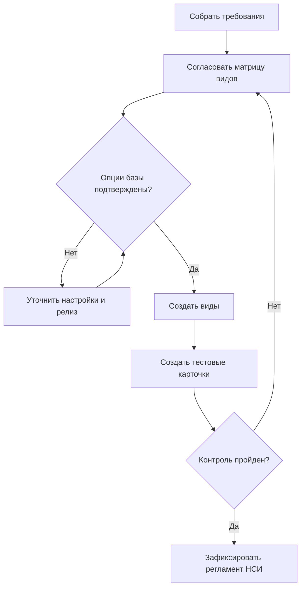

# Создание структуры и карточек номенклатуры

## Цель и границы

Создать согласованные виды и карточки номенклатуры. Настройка производства и рецептур находится за границами процесса.

## Роли

- владелец НСИ согласует классификацию;
- консультант 1С проектирует настройки;
- пользователь НСИ создаёт и проверяет элементы.

## Основной сценарий

1. Собрать требования к типам, единицам, сериям, характеристикам и обязательным реквизитам.
2. Согласовать матрицу видов номенклатуры.
3. Проверить функциональные опции целевой базы.
4. Создать виды номенклатуры.
5. Создать тестовые карточки.
6. Провести контроль заполнения и тест использования в одном документе.
7. Зафиксировать правила сопровождения НСИ.

## Диаграмма

## Критерии приёмки

Тестовые карточки создаются с нужными единицами и правилами учёта; обязательные поля контролируются; карточка успешно выбирается в согласованном тестовом документе.

## Источники

- [Номенклатура и виды номенклатуры](../../knowledge/articles/nomenclature-and-kinds.md)
