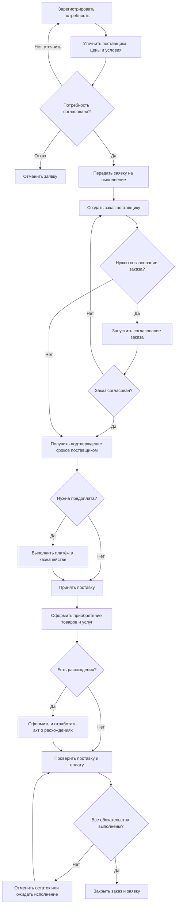

# Типовая закупка товаров у поставщика

> Внутренний черновик до введения шлюзов согласования. Не использовать для подготовки инструкции. После апрува требований процесс должен быть пересобран в `results/standard-procurement/02-design.md` и отдельно утверждён.

## 1. Цель и границы

Обеспечить подтверждённую потребность товарами через управляемую цепочку от заявки на закупку до поступления, обработки расхождений и закрытия заказа поставщику.

Базовый вариант рассчитан на регулярную закупку товаров у российского поставщика. За рамками: импорт, агентская схема, комиссия, ответственное хранение, выбор поставщика через тендер, детальный платёжный процесс, ЭДО и контроль качества. Эти контуры подключаются после уточнения требований.

Статус процесса — `draft`: объекты и возможности подтверждены документацией ИТС, но роли, маршруты согласования и интерфейсные шаги необходимо сверить с целевой информационной базой.

## 2. Допущения

- используется 1С:ERP 2.5.27.49;
- номенклатура к моменту создания заявки определена;
- потребность должна закрываться закупкой, а не складским остатком или перемещением;
- используются заказы поставщикам;
- при существенных отклонениях заказ согласуется;
- поступление связывается с заказом поставщику;
- расчёты и оплата контролируются, но оформление платежа вынесено в смежный процесс казначейства.

## 3. Уточняющие вопросы

| Вопрос | Что изменит ответ |
|---|---|
| Что закупается: товары, услуги, работы или смешанный состав? | Состав документов, реквизитов и складского этапа. |
| Из какого источника возникает потребность: план, заказ клиента, производство, минимальный запас или ручная заявка? | Способ создания заявки и необходимость консолидации. |
| Нужна ли заявка на закупку для каждой закупки? | Наличие первого этапа и маршрута согласования потребности. |
| Поставщик выбирается заранее или через запрос коммерческих предложений? | Необходимость отдельного этапа выбора поставщика. |
| Какие суммы и отклонения требуют согласования? | Настройку маршрутов, ролей и контрольных условий. |
| Используются ли соглашения и договоры с поставщиками? | Автозаполнение и контроль ценовых, финансовых и логистических условий. |
| Есть ли контроль лимитов БДР? | Бюджетную аналитику заявки и обязательный контроль перед выполнением. |
| Требуется предоплата? | Контрольную точку оплаты до подтверждения или поступления. |
| Используется ли ордерная схема склада? | Необходимость приходного ордера и момент завершения приёмки. |
| Как обрабатываются недостачи и излишки? | Ветви акта о расхождениях и документы корректировки. |
| Есть ли контроль качества, серии, сроки годности, маркировка или прослеживаемость? | Дополнительные операции при приёмке. |
| Нужны ли импорт, ЕАЭС, комиссия или закупка через агента? | Выбор другого специализированного сценария. |

## 4. Роли

| Роль | Ответственность |
|---|---|
| Инициатор/менеджер по обеспечению | Фиксирует и обосновывает потребность. |
| Менеджер по закупкам | Уточняет поставщика и условия, формирует заказ, контролирует исполнение. |
| Согласующий | Подтверждает потребность или отклонения от условий закупки. |
| Казначей | Исполняет платёж по согласованным условиям в смежном процессе. |
| Кладовщик/приёмщик | Фиксирует фактическое поступление и расхождения. |
| Бухгалтер/ответственный за документы поставки | Проверяет и проводит финансовый документ поступления. |

## 5. Предусловия

1. Созданы поставщик, контрагент, организация, склады и закупаемая номенклатура.
2. Включены заказы поставщикам и, если используется первый этап, заявки на закупку.
3. Настроены права менеджера по закупкам и согласующих.
4. При использовании соглашений определены цены, валюта, условия оплаты и поставки.
5. Определён порядок приёмки на складе: ордерный или неордерный.
6. Определены правила работы с расхождениями и непоставленными строками.

## 6. Основной сценарий

1. Инициатор или менеджер по обеспечению формирует `Заявку на закупку` с известной номенклатурой, количеством, сроком и источником потребности.
2. Менеджер по закупкам уточняет поставщика, цены и условия. При необходимости получает коммерческие предложения.
3. Согласующий проверяет обоснование, условия и бюджетные лимиты. При одобрении переводит заявку в статус `На выполнении`; при отказе возвращает на уточнение или отменяет.
4. Менеджер по закупкам создаёт `Заказ поставщику` по выбранным строкам заявки.
5. В заказе указываются поставщик, соглашение/договор при их использовании, организация, склад, номенклатура, количество, цены, даты поставки и правила оплаты.
6. Если условия заказа отклоняются от соглашения или внутренние правила требуют согласования, заказ проводится в статусе `На согласовании` и запускается процесс `Согласование заказа поставщику`.
7. После устранения замечаний и положительного решения заказ получает согласованный статус. После подтверждения поставщиком сроков заказ переводится в статус `Подтвержден`.
8. Если правила оплаты требуют аванса до поставки, казначейство выполняет платёж; заказ остаётся под контролем до выполнения платёжного условия.
9. При поставке оформляется `Приобретение товаров и услуг` по заказу поставщику. На ордерном складе дополнительно выполняется фактическая складская приёмка.
10. Приёмщик сравнивает фактическое количество и состояние товара с документами поставщика.
11. Если расхождений нет, поступление завершается. Если есть недостача, излишек или иной количественный разрыв, создаётся `Акт о расхождениях после приемки`, согласуется способ отработки и оформляются требуемые корректирующие документы.
12. Менеджер контролирует состояние заказа: поставку, отменённые строки и оплату. После исполнения обязательств заказ закрывается автоматически либо переводится в статус `Закрыт` согласно настройкам.
13. После формирования заказов и подтверждения исполнения потребности заявка переводится в завершающий статус по принятому регламенту компании.

## 7. Схема процесса

## 8. Исключения

### Заявка не согласована

Вернуть инициатору с замечаниями либо перевести в отменённое состояние. Заказ поставщику не создавать.

### Заказ отклонён

Скорректировать условия и повторно запустить согласование. История согласования должна сохраняться; для заказов рекомендуется включить версионирование.

### Частичная поставка

Оставить непоставленные строки ожидаемыми, согласовать новый срок либо отменить остаток с причиной. Не закрывать заказ при активном контроле поступления.

### Недостача или излишек

Создать акт о расхождениях и выбрать подтверждённый с поставщиком способ отработки. Набор финансовых и складских документов зависит от ордерной схемы и решения по расхождению.

### Поставщик не выбран

Добавить этап запроса и сравнения коммерческих предложений до формирования заказа.

## 9. Необходимые настройки

| Настройка | Базовое значение | Путь | Статус |
|---|---|---|---|
| Заказы поставщикам | Включить | `НСИ и администрирование → Настройка НСИ и разделов → Закупки → Заказы поставщикам` | verified |
| Заявки на закупку | Включить при управлении потребностями | `НСИ и администрирование → Настройка НСИ и разделов → Закупки → Документы закупок → Заявки на закупку` | verified |
| Соглашения с поставщиками | Включить для регулярных условий | `… → Закупки → Соглашения и договоры с поставщиками → Соглашения с поставщиками` | verified |
| Согласование заказов | Включить при формальном согласовании | `… → Закупки → Согласование заказов поставщикам` | verified |
| Акты о расхождениях | Включить при фиксации расхождений | `… → Закупки → Документы закупок → Акты о расхождениях после приемки` | verified |
| Контроль поступления/оплаты при закрытии | Определить регламентом | `… → Закупки → Заказы поставщикам` | verified |
| Ордерная схема | Определить для каждого склада | `[проверить в целевой базе]` | unresolved |
| Контроль лимитов БДР | По бюджетной политике | `[проверить настройки бюджетирования]` | unresolved |

## 10. Критерии приёмки

1. Согласованная заявка позволяет создать заказ поставщику; несогласованная — нет.
2. Отклонение от утверждённых условий обнаруживается и направляется на согласование согласно правам.
3. По подтверждённому заказу оформляется связанное приобретение.
4. Частичная поставка корректно отражается в состоянии заказа.
5. Недостача тестовой позиции фиксируется актом о расхождениях и не теряется при закрытии.
6. Заказ нельзя закрыть вопреки включённым контролям поставки и оплаты.
7. По цепочке документов можно восстановить заявку, заказ, поступление и корректировки.

## 11. Источники

- [Заявки на закупку](../../knowledge/articles/procurement-requests.md)
- [Условия закупок](../../knowledge/articles/procurement-conditions.md)
- [Заказ поставщику](../../knowledge/articles/supplier-orders.md)
- [Поступление и расхождения](../../knowledge/articles/procurement-receipts-and-discrepancies.md)
