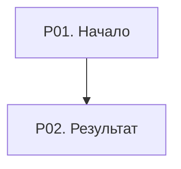

# Инструкция 1С: <процесс>

## Краткая карта процесса

Роли, этапы, входы, результаты и связь идентификаторов `P01`, `P02` и далее со схемой.

## Схема

## Конфигурация, релиз и границы применимости

Указать используемые источники, совместимость XML, отличия конфигурации и неподтверждённые места.

## Роли и права
## Предварительные настройки
## Подготовка НСИ
## Выполнение процесса

Каждый шаг: идентификатор схемы, роль, точный путь, форма, поля, команда, ожидаемый статус, результат, проверка и источник. Одно пользовательское действие — один шаг; повторяющиеся поля — таблицей.

## Исключения и исправления
## Альтернативные варианты
## Ограничения типового функционала и возможные доработки
## Контрольный сценарий
## Источники ИТС, документации и метаданных
## Неподтверждённые места

## Обратная связь

Всё ли устраивает? Инструкция становится успешным примером только после явного подтверждения консультанта.
